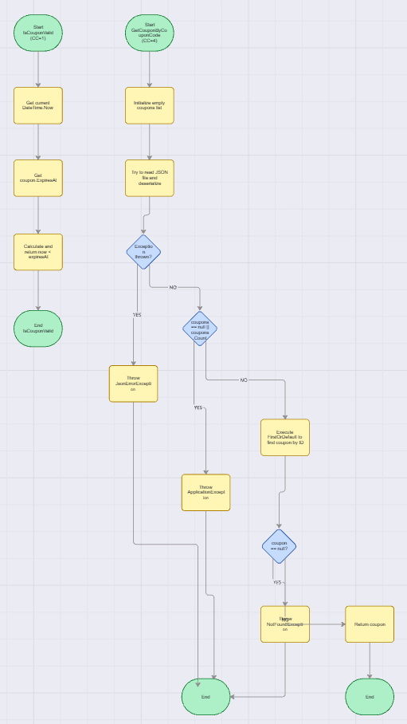
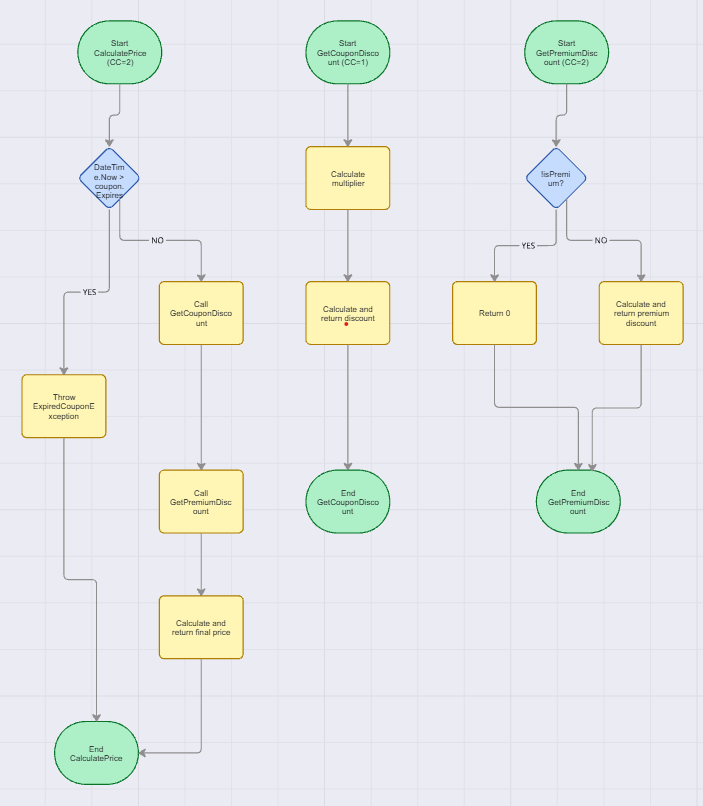
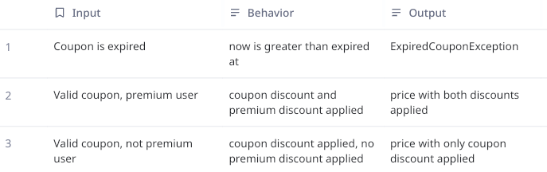
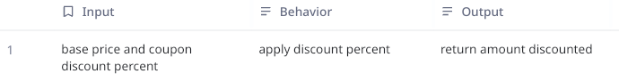
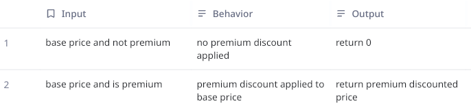
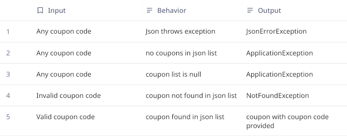
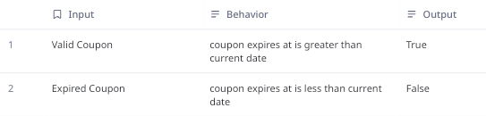
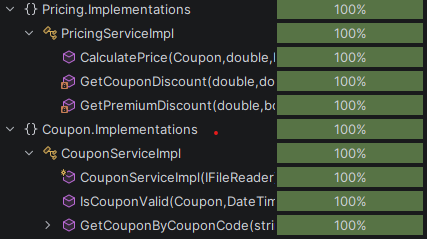

# Testing for Pricing API

## White Box Testing

### What is white box testing?

White box testing is a testing method where the testers have full knowledge of the applications
structure and logic. There is an emphasis on code paths and the possible cases that will be 
encountered through the execution path.

### Cyclomatic Complexity and Path Graphs

To start with white box testing. It is important to create path graphs of the different components
in the application and calculate their cyclomatic complexity. Using this method, we are able to 
create test cases that will "touch" every part of the component's code and ideally have all cases
tested.

#### Coupon Service:

Below is the path graph that was created for the different functions within the Coupon Service
implementation.

Using this path graph we can then calculate the cyclomatic complexity for the functions using the
formula **CC = E - N + 2P**

**N** is the number of "nodes" in a function which is where the function can stop to perform an action
or make a decision.

**E** is the number of "edges" in a function which is the path that can be followed between nodes.

**P** is the number of components, which since we are only testing one function at a time here, will be
one.

Using this function we can see that they cyclomatic complexity for the IsCouponValid function is 1, and the
GetCouponByCouponCode function is 4. 

This is in line with what is expected as the IsCouponValid function only makes one check on the date and does
not perform much logic so the number is lower while the GetCouponByCouponCode function has multiple decision points
that can branch off into different logic.

#### Pricing Service:

Below is also the graph that was created for the Pricing Service Implementation

The same formula is used to calculate cyclomatic complexity for these functions. The result is GetCouponDiscount
with a complexity of 1, and both CalculatePrice and GetPremiumDiscount with a complexity of 2.

#### Cyclomatic Complexity

When cyclomatic complexity is calculated, it is important to pay attention to how big the number is.
Functions with a high cyclomatic complexity can result in a slow application as there are many decision
points that your application can stop at. Using this method can help you catch early what bottlenecks
your application may run into.

### Unit Testing

Now, with the path graphs created for the components that will be tested, test cases can be derived ensuring
full code coverage:

#### CalculatePrice:

#### GetCouponDiscount:

#### GetPremiumDiscount:

#### GetCouponByCouponCode:

#### IsCouponValid:

#### Code Coverage
When unit tests are created for all these test cases, the result is 100% coverage for all tested components:

